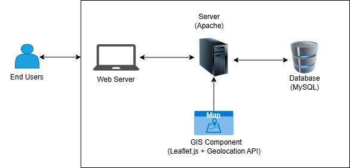
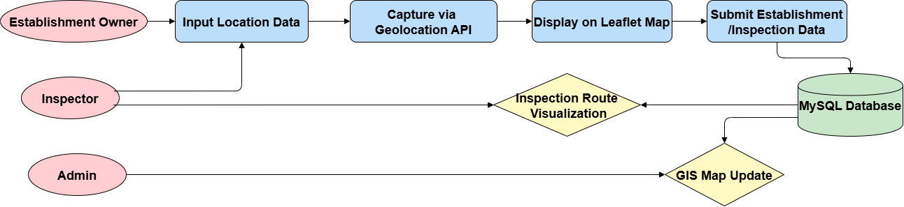
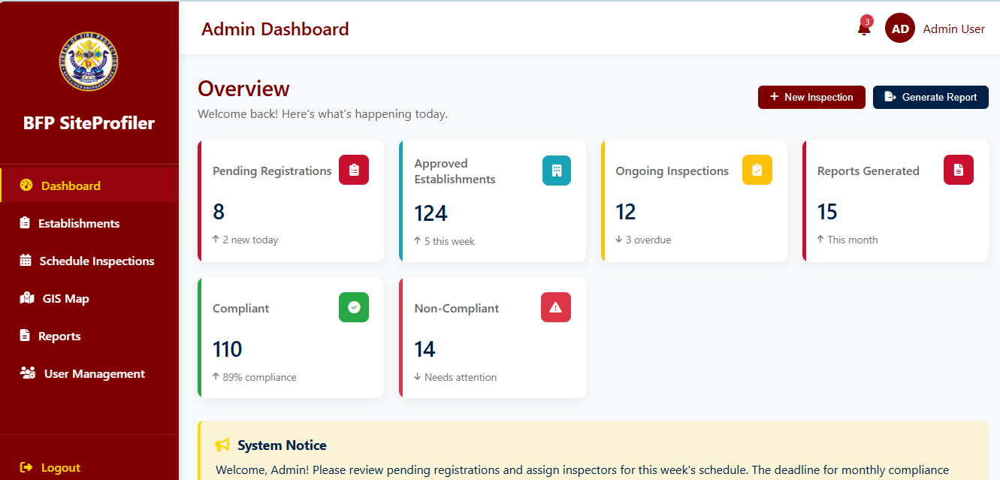
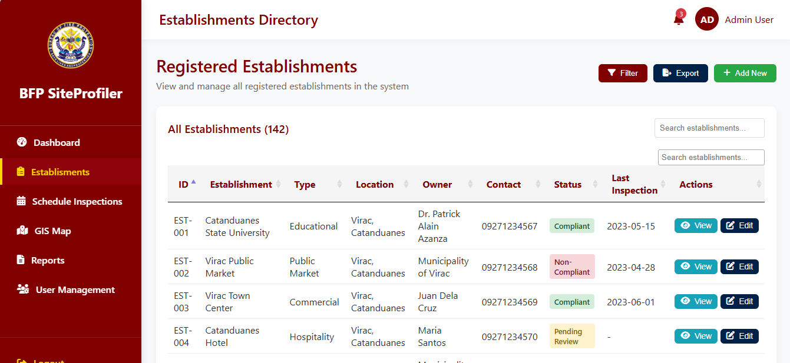
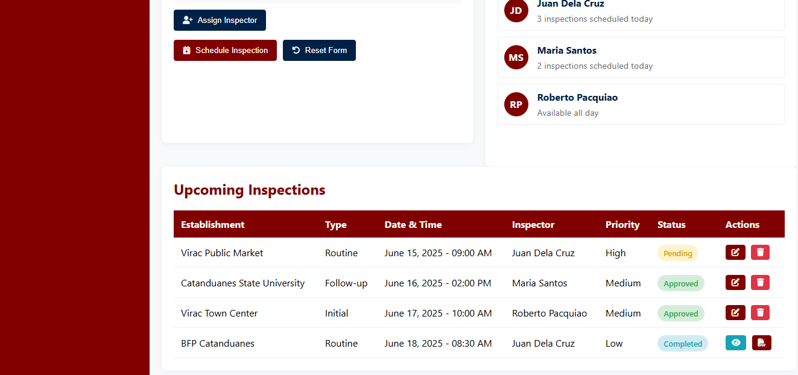
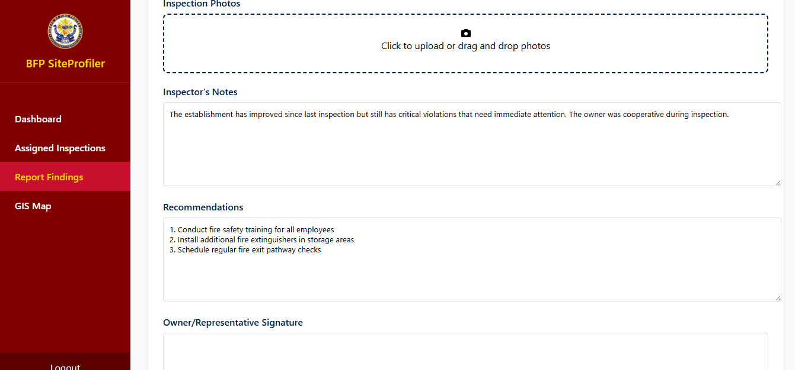
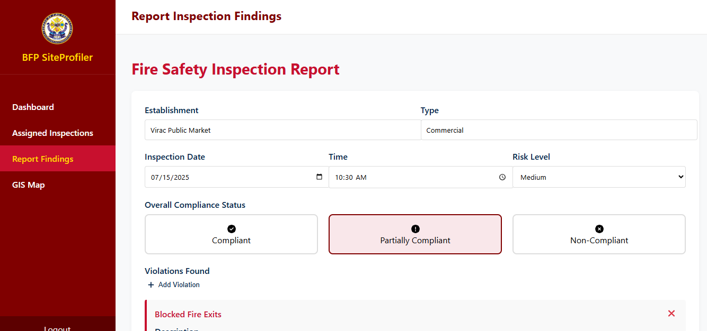
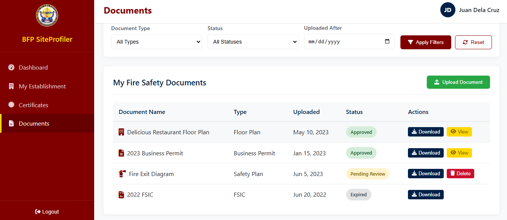
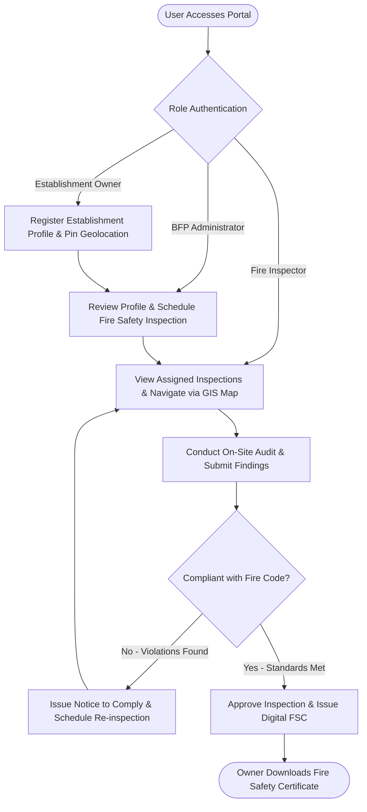

# 🚒 BFP SiteProfiler: A GIS-Integrated Web-Based System for Managing Establishments in Catanduanes

<div align="center">


### *Empowering fire safety governance through geospatial intelligence, seamless digital establishment profiling, and accelerated compliance monitoring.*

[](#-academic-background--authors)
[](https://catsu.edu.ph/)
[](#-academic-background--authors)
[](#)
[](#-academic-background--authors)

<br/>


</div>

---

## 📖 Table of Contents
- [📌 Project Overview](#-project-overview)
- [💡 Why Use This App? (User Benefits)](#-why-use-this-app-user-benefits)
- [✨ Key Features](#-key-features)
- [🛠️ Tech Stack](#️-tech-stack)
- [🖥️ Hardware Infrastructure & Materials](#️-hardware-infrastructure--materials)
- [🖼️ Visual Showcase & Architectural Diagrams](#️-visual-showcase--architectural-diagrams)
- [🔄 How to Use the System (Workflow)](#-how-to-use-the-system-workflow)
- [🚀 Installation & Setup Instructions](#-installation--setup-instructions)
- [🎓 Academic Background & Authors](#-academic-background--authors)

---

## 📌 Project Overview

The **BFP SiteProfiler** is a centralized, web-based management and spatial profiling platform designed specifically for the **Bureau of Fire Protection (BFP)** in **Virac, Catanduanes**. 

By unifying relational establishment profiling with **Geographic Information System (GIS)** mapping via Leaflet.js, the system modernizes fire code administration. It transforms legacy, paper-laden filing procedures into an agile digital ecosystem—enabling instant inspection scheduling, real-time field reporting, location-aware hazard tracking, and transparent compliance monitoring for both fire safety officers and business owners.

---

## 💡 Why Use This App? (User Benefits)

### 🎯 Target Users
1. **BFP Administrative Officers & Fire Safety Enforcers:** Personnel responsible for managing establishment registries, scheduling annual and quarterly inspections, reviewing field reports, tracking Fire Code Fees, and releasing Fire Safety Certificates (FSC).
2. **BFP Field Inspectors:** Firefighters and inspection marshals conducting on-site audits, logging safety discrepancies, and capturing real-time geospatial coordinates in the field.
3. **Establishment & Business Owners:** Commercial, institutional, and industrial building owners in Virac, Catanduanes who need an accessible channel to register their properties, view inspection status, and obtain compliance credentials without bureaucratic bottlenecks.

### 🛡️ Main Problems Solved
- **Elimination of Paper-Heavy Overhead & Data Redundancy:** Replaces cumbersome physical logbooks and paper filing cabinets with a searchable, high-integrity relational database.
- **Geographic Ambiguity & Logistical Inefficiencies:** Solves the challenge of locating remote or dense commercial properties across Catanduanes by providing an interactive GIS map with GPS pin tagging.
- **Delayed Field Feedback Loops:** Inspectors no longer need to return to headquarters to write up findings; reports and photos are logged directly into the system.
- **Enhanced Regulatory Transparency:** Business owners gain full visibility into inspection milestones, required corrective actions, and legitimate compliance certificates, reducing friction and delays.

---

## ✨ Key Features

- 🗺️ **Interactive GIS Map & Geospatial Risk Profiling:** Integrated with [Leaflet.js](https://leafletjs.com/) and OpenStreetMap, plotting establishment locations with color-coded safety markers (`Green` = Compliant, `Amber` = Pending, `Red` = Non-Compliant).
- 🏢 **Digital Establishment Directory:** Comprehensive profiles capturing business classifications, building floor areas, structural materials, occupancy levels, and ownership details.
- 📅 **Automated Inspection Scheduling & Assignment:** Administrators can schedule routine or follow-up fire safety audits and assign available field inspectors with calendar integration.
- 📋 **On-Site Field Findings & Violation Logging:** Field marshals can digitally submit inspection checklists, violation notices, photographic proof, and recommendations straight from field devices.
- 📜 **Fire Safety Certificate (FSC) Management:** Lifecycle tracking from initial application and fee payment verification to digital issuance and expiration tracking.
- 👥 **Role-Based Multi-Portal Architecture:** Strict separation of responsibilities tailored for Administrators, Field Inspectors, and Establishment Clients.
- 📊 **Real-Time Analytical Dashboard:** Visual indicators and dynamic trend charts powered by [Chart.js](https://www.chartjs.org/) for inspection ratios, overdue audits, and monthly compliance metrics.

---

## 🛠️ Tech Stack

The system leverages modern, open-source web technologies for reliability, maintainability, and rapid responsiveness:

### 🎨 Frontend
- **Markup & Styling:** HTML5, Modern CSS3 (Custom Design System with CSS Variables, Flexbox/Grid)
- **CSS Framework:** [Bootstrap 5.3](https://getbootstrap.com/)
- **Iconography:** [Font Awesome 6.4](https://fontawesome.com/)
- **Client-Side Scripting:** JavaScript (Vanilla ES6+ Modules, Fetch API)
- **Data Visualization:** [Chart.js 3.9](https://www.chartjs.org/)

### 🗺️ GIS & Mapping
- **Mapping Engine:** [Leaflet.js 1.9](https://leafletjs.com/)
- **Map Tile Provider:** OpenStreetMap (OSM)
- **Positioning:** HTML5 Geolocation API

### ⚙️ Backend & Architecture (Full Stack Target)
- **Framework & Runtime:** PHP / [Laravel Framework](https://laravel.com/)
- **Web Server:** Apache HTTP Server (via XAMPP development environment)
- **Security:** HTTPS/SSL protocol support for secure geolocation transmission

### 🗄️ Database
- **DBMS:** MySQL Relational Database
- **Schema Entities:** Users, Establishments, Inspections, Findings/Defects, Certificates, Geolocation Coordinates

### 🧰 Development Tools
- **Version Control:** Git & GitHub
- **Environment:** Visual Studio Code, XAMPP

---

## 🖥️ Hardware Infrastructure & Materials

The BFP SiteProfiler integrates tailored physical hardware tiers to support both stationary administration and mobile field operations:

| Hardware Component | Recommended Specifications | Purpose in the Project |
| :--- | :--- | :--- |
| **🖥️ Central Admin Workstation / Server** | Intel Core i7 Processor<br>16 GB DDR4 RAM<br>1 TB Solid State Drive (SSD) | Serves as the central server node. Hosts the Apache web server, MySQL relational database, processes spatial GIS queries, and handles concurrent client connections across the station. |
| **💻 Mobile Field Terminals & Laptops** | Intel Core i5 Processor<br>8 GB RAM<br>500 GB Storage | Deployed for station personnel and administrative clerks to manage registries, review batch records, and oversee regional compliance schedules. |
| **📱 Field Tablets & Smartphones** | Android / iOS Device with GPS Geolocation Sensor & Camera | Utilized by BFP Inspectors on-site. Enables direct capture of real-time GPS coordinates via the HTML5 Geolocation API, field entry of inspection checklists, and on-the-spot violation evidence recording. |

---

## 🖼️ Visual Showcase & Architectural Diagrams

### 1. Hardware Architecture & System Topology
The diagram below illustrates how client devices (field laptops, tablets, and admin workstations) interface through the Apache web server and MySQL database, integrated with Leaflet GIS mapping components:

<div align="center">
  
  <p><em>Figure: System Architecture & Hardware Deployment Model</em></p>
</div>

### 2. GIS Integration & Geolocation Pipeline
<div align="center">
  
  <p><em>Figure: Geospatial Coordinates Capture & Leaflet Mapping Data Pipeline</em></p>
</div>

### 3. Application Interface Prototypes

| Admin Overview & Analytics | Establishment Directory Management |
| :---: | :---: |
|  |  |
| **Real-time compliance counters & action items** | **Comprehensive searchable building database** |

| Inspection Scheduling | Field Findings & Defect Logging |
| :---: | :---: |
|  |  |
| **Inspector assignment & inspection calendars** | **On-site defect logging and hazard tagging** |

| Inspector Assigned Tasks | Client Certificates & Compliance |
| :---: | :---: |
|  |  |
| **Assigned itinerary and location-tagged jobs** | **Digital Fire Safety Inspection Certificate tracking** |

---

## 🔄 How to Use the System (Workflow)



1. **Step 1: Role-Based Authentication**  
   Users open `html/index.html` and sign in using their respective credentials (Admin, Inspector, or Establishment Owner).

2. **Step 2: Digital Establishment Registration**  
   The business owner fills out the establishment profiling form (structure type, occupancy classification, address) and allows the system to capture the precise GPS coordinate of the building.

3. **Step 3: Verification & Inspection Scheduling**  
   The BFP Administrator reviews the registered establishment, validates the Fire Code Fee assessment, and assigns a certified fire inspector along with an inspection date.

4. **Step 4: Field Audit & Findings Recording**  
   The assigned Inspector opens their portal in the field, locates the establishment via the GIS map, inspects fire extinguishers, emergency exits, and electrical systems, and logs the report directly into the system.

5. **Step 5: Certification or Rectification**  
   If the establishment passes, the system updates its marker to **Compliant (`Green`)** and releases the official **Fire Safety Certificate (FSC)** for instant download. If non-compliant, specific corrective actions are dispatched immediately.

---

## 🚀 Installation & Setup Instructions

To run this project locally on your machine for demonstration, evaluation, or further development:

### Prerequisites
- A modern web browser (Google Chrome, Microsoft Edge, Mozilla Firefox)
- [Git](https://git-scm.com/) installed on your machine
- *(Optional)* [XAMPP](https://www.apachefriends.org/) or [VS Code Live Server](https://marketplace.visualstudio.com/items?itemName=ritwickdey.LiveServer) for local HTTP serving

### 1. Clone the Repository
```bash
git clone https://github.com/JAPEE45/BFP-Site-Profiler.git
cd BFP-Site-Profiler
```

### 2. Directory Layout
```text
BFP-Site-Profiler/
├── assets/
│   ├── images/              # Official seals, hero visuals, diagrams, and UI captures
│   ├── scripts/             # Modular JavaScript logic (dashboards, charts, GIS)
│   └── styles/              # CSS stylesheets (components, layouts, variables)
├── html/
│   ├── index.html           # Main Login & Authentication Gateway
│   ├── admin/               # Administrator control panel, schedules, reports
│   ├── inspector/           # Field Inspector dashboard & findings logging
│   └── user/                # Establishment Owner self-service portal
├── MANUSCRIPT_01.docx       # Complete Academic Capstone Research Manuscript
└── README.md                # Project Documentation
```

### 3. Launching Locally

#### Method A: Direct Browser Opening (Quick Preview)
Simply open the entry file in your browser:
- Double click or open `html/index.html` in your web browser.

#### Method B: Using VS Code Live Server (Recommended)
1. Open the project folder in **Visual Studio Code**.
2. Install the **Live Server** extension.
3. Right-click `html/index.html` and click **"Open with Live Server"**.
4. The application will launch at `http://127.0.0.1:5500/html/index.html`.

#### Method C: Using Apache / XAMPP
1. Move the `BFP-Site-Profiler` folder into your `htdocs` directory (e.g., `C:/xampp/htdocs/BFP-Site-Profiler`).
2. Start the **Apache** service in the XAMPP Control Panel.
3. Navigate to `http://localhost/BFP-Site-Profiler/html/index.html` in your browser.

### 🔑 Demo Prototype Credentials
Use the following demo accounts to test each portal:

| Role | Username | Password | Redirect Target |
| :--- | :--- | :--- | :--- |
| **BFP Administrator** | `admin` | `admin` | Admin Command Dashboard |
| **Field Inspector** | `inspector` | `inspector` | Field Inspector Terminal |
| **Establishment Owner** | `user` | `user` | Client Self-Service Portal |

---

## 🎓 Academic Background & Authors

> [!NOTE]
> This project is an official **Undergraduate Capstone Research Project** developed by collegiate researchers in partial fulfillment of the requirements for the degree of **Bachelor of Science in Information Systems (BSIS)**.

---

<div align="center">
  <sub>Bureau of Fire Protection (BFP) SiteProfiler • Catanduanes State University CICT • © 2025</sub>
</div>
